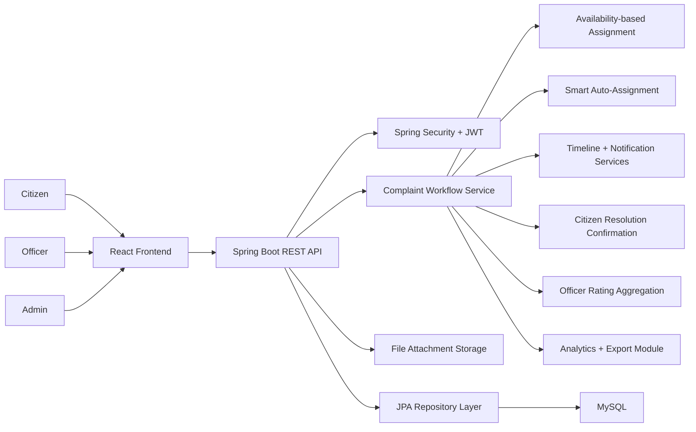

# People Voice

People Voice is a full-stack smart citizen governance platform for reporting, assigning, tracking, and resolving public grievances. Citizens can create their own accounts and raise complaints, admins can assign work to officers based on availability, officers can update complaint progress, and citizens provide the final confirmation when local work is completed.

This project is designed as a portfolio-ready civic tech system that demonstrates secure authentication, role-based workflows, backend business logic, responsive dashboard design, analytics, and officer performance feedback.

## Highlights

- Full-stack architecture with Spring Boot backend and React frontend
- JWT-based authentication with role-based access control
- Citizen self-registration and complaint submission
- Admin assignment workflow based on officer availability
- Officer progress updates and locality work handling
- Citizen-side final resolution confirmation
- Officer ratings based on completed work
- Complaint image upload and attachment review
- Officer completion proof uploads from the officer dashboard
- Timeline tracking for each complaint
- In-app notifications for citizens, officers, and admin
- Email/SMS-style notification delivery status badges
- Configurable email and SMS webhook delivery support
- Real-time dashboard refresh using server-sent events
- Smart auto-assignment based on availability, workload, and ratings
- Admin-managed officer creation, editing, and activation control
- Visual analytics dashboard with category, status, priority, and officer performance views
- Analytics reporting with PDF and Excel export

## Problem Statement

Public grievance systems often make it difficult for citizens to know who is handling their issue and whether local work has actually been completed. People Voice improves that process by giving:

- Citizens a direct way to register, raise complaints, and confirm final resolution
- Admins a structured assignment dashboard to distribute work across officers
- Officers a focused operational queue with availability-based routing
- Governance teams better visibility into progress, workload, notifications, and officer performance

## Tech Stack

**Backend**

- Java 17
- Spring Boot
- Spring Security
- JWT Authentication
- Spring Data JPA
- MySQL
- Apache POI for Excel export
- OpenPDF for PDF generation

**Frontend**

- React
- Vite
- Axios
- React Router
- Bootstrap

**Database**

- MySQL as the primary runtime database
- SQL schema included for relational setup reference

## Core Workflow

### Citizen Flow

- Register a new citizen account
- Log in and submit a complaint
- Upload image evidence of the issue
- Track complaint assignment and progress
- Review complaint timeline and attachments
- Confirm whether locality work is actually resolved
- Rate the officer after successful completion

### Admin Flow

- View all complaints in the assignment desk
- Monitor officer availability
- Assign complaints only to available officers
- Auto-assign complaints using workload and rating aware routing
- Create and manage officer accounts
- Review notification alerts and complaint timelines
- Track analytics and export operational reports

### Officer Flow

- Update personal availability as `AVAILABLE`, `BUSY`, or `OFFLINE`
- Work only on assigned complaints
- Move complaints to `IN_PROGRESS`
- Mark work as complete and send it for citizen confirmation
- Receive notification updates when work is assigned or status changes

## Features

### Complaint Lifecycle

- `OPEN` when a citizen submits a complaint
- `ASSIGNED` when the admin assigns it to an officer
- `IN_PROGRESS` while the officer is working
- `PENDING_CITIZEN_CONFIRMATION` when field work is completed
- `RESOLVED` only after the citizen confirms completion

### Smart Prioritization

Complaints are auto-prioritized using locality-density heuristics and category importance. Issues from dense localities or essential categories such as sanitation and water can be escalated in urgency.

### Officer Rating System

After confirming a complaint is resolved, the citizen can rate the officer from 1 to 5. Ratings are aggregated and shown in the admin officer panel as average score and total count.

### Timeline and Notifications

Each complaint maintains a timeline of important workflow events such as submission, assignment, status updates, attachment uploads, and citizen confirmation. The system also generates in-app notifications so citizens, officers, and admins can quickly see actions that need attention.

### File Uploads and Evidence

Citizens can upload image evidence while submitting or updating complaints. Attachments remain visible in the complaint detail view so admins and officers can understand the issue before acting on it.

Officers can also upload completion-proof images from their dashboard before moving a complaint to citizen confirmation, making the resolution process more transparent for both citizens and admins.

## Screenshots

Add screenshots to the `screenshots/` folder and reference them here for a stronger portfolio presentation.

Suggested captures:

- Login page
- Citizen registration page
- Citizen complaint dashboard
- Admin assignment dashboard
- Officer workflow dashboard
- Analytics and officer ratings panel

Example structure:

```text
screenshots/
|-- login.png
|-- register.png
|-- citizen-dashboard.png
|-- admin-dashboard.png
|-- officer-dashboard.png
`-- analytics.png
```

Example Markdown once images are added:

```md


```

## Architecture Diagram



The architecture is layered so the UI focuses on role-based user flows, the backend owns workflow and assignment rules, and the database persists complaints, users, officer ratings, and analytics-ready records.

## Project Structure

```text
smart-complaint-system/
|-- backend/          Spring Boot REST API
|-- frontend/         React + Vite web client
|-- database/         SQL schema
|-- screenshots/      Project screenshots
|-- LICENSE
`-- README.md
```

## Demo Accounts

Use these seeded demo accounts after starting the backend:

- Citizen: `citizen@peoplevoice.local` / `password`
- Admin Kiran: `admin@peoplevoice.local` / `password`
- Officer Pradeep: `pradeep@peoplevoice.local` / `password`
- Officer Rajesh: `rajesh@peoplevoice.local` / `password`
- Officer Chaitanya: `chaitanya@peoplevoice.local` / `password`
- Officer Nagur: `nagur@peoplevoice.local` / `password`
- Officer Vinesh: `vinesh@peoplevoice.local` / `password`
- Officer Jayaram: `jayaram@peoplevoice.local` / `password`
- Officer Ramu: `ramu@peoplevoice.local` / `password`

## Getting Started

### Prerequisites

- Java 17 or later
- Maven
- Node.js 18 or later recommended
- npm
- MySQL server

### Environment Variables

For local development, set your MySQL credentials before running the backend.

**PowerShell**

```powershell
$env:DB_USERNAME="root"
$env:DB_PASSWORD="your_mysql_password"
```

**Git Bash**

```bash
export DB_USERNAME=root
export DB_PASSWORD=your_mysql_password
```

Optional notification delivery webhooks:

**PowerShell**

```powershell
$env:EMAIL_NOTIFICATIONS_ENABLED="true"
$env:EMAIL_WEBHOOK_URL="https://your-email-provider-webhook"
$env:EMAIL_WEBHOOK_TOKEN="your_email_token"
$env:EMAIL_FROM="peoplevoice@yourdomain.com"
$env:SMS_NOTIFICATIONS_ENABLED="true"
$env:SMS_WEBHOOK_URL="https://your-sms-provider-webhook"
$env:SMS_WEBHOOK_TOKEN="your_sms_token"
$env:SMS_FROM="PEOPLEVOICE"
```

### Run the Backend

```bash
cd backend
mvn clean install
mvn spring-boot:run
```

Backend endpoint:

- API base URL: `http://localhost:8080/api`

### Run the Frontend

```bash
cd frontend
npm install
npm run dev
```

Frontend endpoint:

- Application: `http://localhost:3000`

### Frontend Environment

Create `frontend/.env` for local development if you want to override the backend URL:

```properties
VITE_API_BASE_URL=http://localhost:8080/api
```

For production hosting, set `VITE_API_BASE_URL` to your deployed backend URL, for example:

```properties
VITE_API_BASE_URL=https://people-voice-backend.onrender.com/api
```

## Application Properties

The backend uses environment-variable based database configuration:

```properties
spring.datasource.url=${DB_URL:jdbc:mysql://localhost:3306/peoplevoice?createDatabaseIfNotExist=true&useSSL=false&allowPublicKeyRetrieval=true&serverTimezone=Asia/Kolkata}
spring.datasource.username=${DB_USERNAME:root}
spring.datasource.password=${DB_PASSWORD:}
```

This keeps credentials out of source control while still allowing local defaults where appropriate.

Notification delivery is also environment-driven:

```properties
app.notifications.email.enabled=${EMAIL_NOTIFICATIONS_ENABLED:false}
app.notifications.email.webhook-url=${EMAIL_WEBHOOK_URL:}
app.notifications.email.auth-token=${EMAIL_WEBHOOK_TOKEN:}
app.notifications.email.from=${EMAIL_FROM:peoplevoice@local}
app.notifications.sms.enabled=${SMS_NOTIFICATIONS_ENABLED:false}
app.notifications.sms.webhook-url=${SMS_WEBHOOK_URL:}
app.notifications.sms.auth-token=${SMS_WEBHOOK_TOKEN:}
app.notifications.sms.from=${SMS_FROM:PEOPLEVOICE}
```

When these are configured, People Voice will send notification payloads to your email and SMS provider webhooks and store the resulting delivery status as `SENT`, `SKIPPED`, or `FAILED`.

## Deployment

### Recommended Hosting

- Frontend: Vercel
- Backend: Render
- Database: MySQL on Railway, Aiven, PlanetScale, or another managed provider

### Backend Deployment

Deploy the `backend` folder as a Docker web service on Render.

Required environment variables:

```properties
DB_URL=jdbc:mysql://your-aiven-host:your-aiven-port/defaultdb?sslMode=REQUIRED&allowPublicKeyRetrieval=true&serverTimezone=UTC
DB_USERNAME=your_db_username
DB_PASSWORD=your_db_password
```

For Aiven MySQL, do not paste the service URI if it starts with `mysql://`.
Render must receive a JDBC URL that starts with `jdbc:mysql://`, and the host,
port, database name, username, and password should come from Aiven's connection
details. A common Aiven username is `avnadmin`.

Recommended optional environment variables:

```properties
EMAIL_NOTIFICATIONS_ENABLED=false
SMS_NOTIFICATIONS_ENABLED=false
EMAIL_WEBHOOK_URL=
EMAIL_WEBHOOK_TOKEN=
SMS_WEBHOOK_URL=
SMS_WEBHOOK_TOKEN=
```

On Render, use:

- Language: `Docker`
- Root directory: `backend`

The repo includes a production-ready Dockerfile at `backend/Dockerfile`.

### Frontend Deployment

Deploy the `frontend` folder as a Vite static app.

Set:

```properties
VITE_API_BASE_URL=https://your-backend-domain/api
```

Typical Vercel setup:

- Root directory: `frontend`
- Build command: `npm run build`
- Output directory: `dist`

### Deployment Checklist

1. Deploy MySQL database
2. Deploy backend with `DB_URL`, `DB_USERNAME`, and `DB_PASSWORD`
3. Confirm backend health and API access
4. Deploy frontend with `VITE_API_BASE_URL`
5. Open the app and test login, complaint creation, assignment, and realtime updates

## API Overview

### Authentication

- `POST /api/auth/register`
- `POST /api/auth/login`
- `POST /api/auth/refresh`

### Complaints

- `GET /api/complaints`
- `POST /api/complaints`
- `GET /api/complaints/{id}`
- `PUT /api/complaints/{id}`
- `PUT /api/complaints/{id}/assign`
- `PUT /api/complaints/{id}/auto-assign`
- `POST /api/complaints/{id}/attachments`
- `PUT /api/complaints/{id}/citizen-confirmation`
- `DELETE /api/complaints/{id}`

### Users and Officer Availability

- `GET /api/users/me`
- `GET /api/users/officers`
- `POST /api/users/officers`
- `PUT /api/users/officers/{id}`
- `PUT /api/users/officers/{id}/active`
- `PUT /api/users/me/availability`

### Notifications and Public Files

- `GET /api/notifications`
- `PUT /api/notifications/{id}/read`
- `GET /api/public/files/{id}`

### Analytics

- `GET /api/analytics/reports`
- `GET /api/analytics/export/pdf`
- `GET /api/analytics/export/excel`

## Architecture Notes

- The backend is organized into controller, service, repository, DTO, model, and security layers.
- Registration is citizen-first by default.
- Officer assignment is availability-aware and admin-controlled.
- Smart assignment considers availability, active workload, and officer ratings.
- Complaint resolution is not final until the citizen confirms it.
- Officer ratings are derived from completed complaint confirmations.
- Complaint attachments and timeline entries are persisted as first-class records.
- Notifications are generated for key workflow events across roles with email/SMS-style delivery status indicators.
- Live dashboard updates are pushed through server-sent events for complaints and notifications.
- The frontend provides separate role-based experiences for citizens, admins, and officers.

## Why This Project Works Well in a Portfolio

People Voice demonstrates more than basic CRUD. It combines:

- secure authentication and authorization
- multi-role workflow design
- availability-based operational assignment
- smart routing using workload and performance signals
- citizen-driven final resolution logic
- complaint evidence upload and review
- officer completion-proof uploads
- timeline visibility and in-app notifications
- admin staff management with activation control
- officer feedback and rating aggregation
- export/reporting functionality
- a practical civic technology use case

It is a strong showcase project for full-stack Java and React development, especially for illustrating secure REST API design, workflow modeling, and dashboard-oriented product implementation.

## Future Improvements

- Introduce WebSocket-based real-time updates
- Add charts for analytics and officer performance
- Deploy backend and frontend to a public cloud environment

## License

This project is licensed under the MIT License. See the `LICENSE` file for details.
