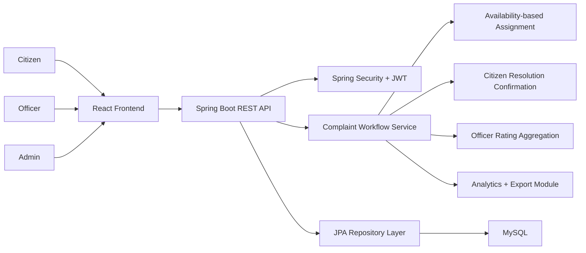

# People Voice

People Voice is a full-stack smart citizen governance platform for reporting, assigning, tracking, and resolving public grievances. Citizens can create their own accounts and raise complaints, admins can assign work to officers based on availability, officers can update complaint progress, and citizens provide the final confirmation when local work is completed.

This project is designed as a portfolio-ready civic tech system that demonstrates secure authentication, role-based workflows, backend business logic, responsive dashboard design, analytics, and officer performance feedback.

## Highlights

- Full-stack architecture with Spring Boot backend and React frontend
- JWT-based authentication with role-based access control
- Citizen self-registration and complaint submission
- Admin assignment workflow based on officer availability
- Officer progress updates and locality work handling
- Citizen-side final resolution confirmation
- Officer ratings based on completed work
- Analytics reporting with PDF and Excel export

## Problem Statement

Public grievance systems often make it difficult for citizens to know who is handling their issue and whether local work has actually been completed. People Voice improves that process by giving:

- Citizens a direct way to register, raise complaints, and confirm final resolution
- Admins a structured assignment dashboard to distribute work across officers
- Officers a focused operational queue with availability-based routing
- Governance teams better visibility into progress, workload, and officer performance

## Tech Stack

**Backend**

- Java 17
- Spring Boot
- Spring Security
- JWT Authentication
- Spring Data JPA
- MySQL
- Apache POI for Excel export
- OpenPDF for PDF generation

**Frontend**

- React
- Vite
- Axios
- React Router
- Bootstrap

**Database**

- MySQL as the primary runtime database
- SQL schema included for relational setup reference

## Core Workflow

### Citizen Flow

- Register a new citizen account
- Log in and submit a complaint
- Track complaint assignment and progress
- Confirm whether locality work is actually resolved
- Rate the officer after successful completion

### Admin Flow

- View all complaints in the assignment desk
- Monitor officer availability
- Assign complaints only to available officers
- Track analytics and export operational reports

### Officer Flow

- Update personal availability as `AVAILABLE`, `BUSY`, or `OFFLINE`
- Work only on assigned complaints
- Move complaints to `IN_PROGRESS`
- Mark work as complete and send it for citizen confirmation

## Features

### Complaint Lifecycle

- `OPEN` when a citizen submits a complaint
- `ASSIGNED` when the admin assigns it to an officer
- `IN_PROGRESS` while the officer is working
- `PENDING_CITIZEN_CONFIRMATION` when field work is completed
- `RESOLVED` only after the citizen confirms completion

### Smart Prioritization

Complaints are auto-prioritized using locality-density heuristics and category importance. Issues from dense localities or essential categories such as sanitation and water can be escalated in urgency.

### Officer Rating System

After confirming a complaint is resolved, the citizen can rate the officer from 1 to 5. Ratings are aggregated and shown in the admin officer panel as average score and total count.

## Screenshots

Add screenshots to the `screenshots/` folder and reference them here for a stronger portfolio presentation.

Suggested captures:

- Login page
- Citizen registration page
- Citizen complaint dashboard
- Admin assignment dashboard
- Officer workflow dashboard
- Analytics and officer ratings panel

Example structure:

```text
screenshots/
|-- login.png
|-- register.png
|-- citizen-dashboard.png
|-- admin-dashboard.png
|-- officer-dashboard.png
`-- analytics.png
```

Example Markdown once images are added:

```md


```

## Architecture Diagram



The architecture is layered so the UI focuses on role-based user flows, the backend owns workflow and assignment rules, and the database persists complaints, users, officer ratings, and analytics-ready records.

## Project Structure

```text
smart-complaint-system/
|-- backend/          Spring Boot REST API
|-- frontend/         React + Vite web client
|-- database/         SQL schema
|-- screenshots/      Project screenshots
|-- LICENSE
`-- README.md
```

## Demo Accounts

Use these seeded demo accounts after starting the backend:

- Citizen: `citizen@peoplevoice.local` / `password`
- Admin Kiran: `admin@peoplevoice.local` / `password`
- Officer Pradeep: `pradeep@peoplevoice.local` / `password`
- Officer Rajesh: `rajesh@peoplevoice.local` / `password`
- Officer Chaitanya: `chaitanya@peoplevoice.local` / `password`
- Officer Nagur: `nagur@peoplevoice.local` / `password`
- Officer Vinesh: `vinesh@peoplevoice.local` / `password`
- Officer Jayaram: `jayaram@peoplevoice.local` / `password`
- Officer Ramu: `ramu@peoplevoice.local` / `password`

## Getting Started

### Prerequisites

- Java 17 or later
- Maven
- Node.js 18 or later recommended
- npm
- MySQL server

### Environment Variables

For local development, set your MySQL credentials before running the backend.

**PowerShell**

```powershell
$env:DB_USERNAME="root"
$env:DB_PASSWORD="your_mysql_password"
```

**Git Bash**

```bash
export DB_USERNAME=root
export DB_PASSWORD=your_mysql_password
```

### Run the Backend

```bash
cd backend
mvn clean install
mvn spring-boot:run
```

Backend endpoint:

- API base URL: `http://localhost:8080/api`

### Run the Frontend

```bash
cd frontend
npm install
npm run dev
```

Frontend endpoint:

- Application: `http://localhost:3000`

## Application Properties

The backend uses environment-variable based database configuration:

```properties
spring.datasource.url=${DB_URL:jdbc:mysql://localhost:3306/peoplevoice?createDatabaseIfNotExist=true&useSSL=false&allowPublicKeyRetrieval=true&serverTimezone=Asia/Kolkata}
spring.datasource.username=${DB_USERNAME:root}
spring.datasource.password=${DB_PASSWORD:}
```

This keeps credentials out of source control while still allowing local defaults where appropriate.

## API Overview

### Authentication

- `POST /api/auth/register`
- `POST /api/auth/login`
- `POST /api/auth/refresh`

### Complaints

- `GET /api/complaints`
- `POST /api/complaints`
- `GET /api/complaints/{id}`
- `PUT /api/complaints/{id}`
- `PUT /api/complaints/{id}/assign`
- `PUT /api/complaints/{id}/citizen-confirmation`
- `DELETE /api/complaints/{id}`

### Users and Officer Availability

- `GET /api/users/me`
- `GET /api/users/officers`
- `PUT /api/users/me/availability`

### Analytics

- `GET /api/analytics/reports`
- `GET /api/analytics/export/pdf`
- `GET /api/analytics/export/excel`

## Architecture Notes

- The backend is organized into controller, service, repository, DTO, model, and security layers.
- Registration is citizen-first by default.
- Officer assignment is availability-aware and admin-controlled.
- Complaint resolution is not final until the citizen confirms it.
- Officer ratings are derived from completed complaint confirmations.
- The frontend provides separate role-based experiences for citizens, admins, and officers.

## Why This Project Works Well in a Portfolio

People Voice demonstrates more than basic CRUD. It combines:

- secure authentication and authorization
- multi-role workflow design
- availability-based operational assignment
- citizen-driven final resolution logic
- officer feedback and rating aggregation
- export/reporting functionality
- a practical civic technology use case

It is a strong showcase project for full-stack Java and React development, especially for illustrating secure REST API design, workflow modeling, and dashboard-oriented product implementation.

## Future Improvements

- Add complaint image and document uploads
- Add live notifications by email or SMS
- Introduce WebSocket-based real-time updates
- Add complaint history timeline and audit logs
- Add charts for analytics and officer performance
- Add admin-managed staff creation instead of relying on seeded demo users
- Deploy backend and frontend to a public cloud environment

## License

This project is licensed under the MIT License. See the `LICENSE` file for details.
